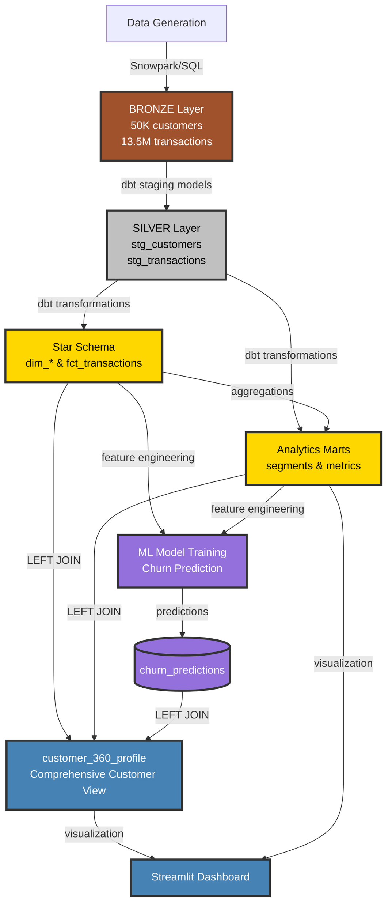

# Customer 360 Analytics Platform - Architecture

## System Architecture Diagram

```mermaid
graph TB
    subgraph Snowflake["Snowflake Data Cloud"]
        subgraph DataGeneration["Data Generation Layer"]
            SP[Snowpark Stored Procedure<br/>generate_customers]
            SQL[SQL Script<br/>generate_transactions.sql]
        end

        subgraph Bronze["BRONZE Layer - Raw Data"]
            BC[(bronze_customers<br/>50K rows)]
            BT[(bronze_transactions<br/>13.5M rows)]
        end

        subgraph Silver["SILVER Layer - Cleaned & Conformed"]
            SC[stg_customers<br/>View]
            ST[stg_transactions<br/>Incremental Model]
        end

        subgraph Gold["GOLD Layer - Business Logic"]
            subgraph CoreDimensions["Core Star Schema"]
                DC[dim_customer<br/>SCD Type 2]
                DD[dim_date<br/>580 days]
                DM[dim_merchant_category]
                FT[fct_transactions<br/>Clustered by date]
            end

            subgraph Analytics["Analytics Marts"]
                CS[customer_segments<br/>5 behavioral segments]
                MLTV[metric_customer_ltv]
                MMOM[metric_mom_spend_change]
                MATV[metric_avg_transaction_value]
            end
        end

        subgraph ML["Machine Learning Layer"]
            MLM[Churn Prediction Model<br/>Snowflake ML]
            CP[(churn_predictions)]
        end

        subgraph Consumption["Consumption Layer"]
            C360[customer_360_profile<br/>Denormalized view]
            STR[Streamlit Dashboard]
        end

        subgraph Orchestration["Orchestration"]
            DBT[dbt Core / Native<br/>Transformations]
            TASKS[Snowflake Tasks<br/>DAG Pipeline]
            STREAMS[Streams<br/>CDC]
        end
    end

    %% Data Generation Flow
    SP -->|Generates| BC
    SQL -->|Generates| BT

    %% Bronze to Silver
    BC -->|dbt staging| SC
    BT -->|dbt staging| ST

    %% Silver to Gold - Core
    SC -->|dbt transform| DC
    SC -->|dbt transform| DD
    ST -->|dbt transform| DM
    ST -->|dbt transform| FT
    DC -->|Join| FT
    DD -->|Join| FT
    DM -->|Join| FT

    %% Gold - Analytics
    DC -->|Aggregate| CS
    FT -->|Aggregate| CS
    FT -->|Calculate| MLTV
    FT -->|Calculate| MMOM
    FT -->|Calculate| MATV

    %% ML Training
    CS -->|Features| MLM
    FT -->|Features| MLM
    DC -->|Features| MLM
    MLM -->|Predictions| CP

    %% Customer 360
    DC -->|Join| C360
    CS -->|Join| C360
    MLTV -->|Join| C360
    MATV -->|Join| C360
    CP -->|Join| C360

    %% Consumption
    C360 -->|Powers| STR
    CS -->|Powers| STR
    FT -->|Powers| STR

    %% Orchestration
    DBT -.->|Orchestrates| Silver
    DBT -.->|Orchestrates| Gold
    TASKS -.->|Schedules| DataGeneration
    TASKS -.->|Schedules| DBT
    TASKS -.->|Schedules| ML
    STREAMS -.->|CDC Triggers| ST

    classDef bronze fill:#A0522D,stroke:#333,stroke-width:2px,color:#fff
    classDef silver fill:#C0C0C0,stroke:#333,stroke-width:2px,color:#000
    classDef gold fill:#FFD700,stroke:#333,stroke-width:2px,color:#000
    classDef ml fill:#9370DB,stroke:#333,stroke-width:2px,color:#fff
    classDef consumption fill:#4682B4,stroke:#333,stroke-width:2px,color:#fff
    classDef orchestration fill:#2F4F4F,stroke:#333,stroke-width:2px,color:#fff

    class BC,BT bronze
    class SC,ST silver
    class DC,DD,DM,FT,CS,MLTV,MMOM,MATV gold
    class MLM,CP ml
    class C360,STR consumption
    class DBT,TASKS,STREAMS orchestration
```



## Layered Architecture View

```mermaid
flowchart LR
    subgraph Layer1["Layer 1: BRONZE<br/>(Raw Data)"]
        B1[bronze_customers<br/>bronze_transactions]
    end

    subgraph Layer2["Layer 2: SILVER<br/>(Cleaned & Conformed)"]
        S1[stg_customers<br/>stg_transactions]
    end

    subgraph Layer3["Layer 3: GOLD<br/>(Business Logic)"]
        G1[Star Schema:<br/>4 dims + 1 fact]
        G2[Analytics Marts:<br/>4 metrics tables]
        G3[Segmentation:<br/>customer_segments]
    end

    subgraph Layer4["Layer 4: ML<br/>(Predictions)"]
        M1[churn_predictions]
    end

    subgraph Layer5["Layer 5: CONSUMPTION<br/>(Application)"]
        C1[customer_360_profile]
        C2[Streamlit Dashboard]
    end

    Layer1 -->|dbt staging| Layer2
    Layer2 -->|dbt transform| Layer3
    Layer3 -->|train model| Layer4
    Layer3 & Layer4 -->|join & aggregate| Layer5

    style Layer1 fill:#A0522D,color:#fff
    style Layer2 fill:#C0C0C0,color:#000
    style Layer3 fill:#FFD700,color:#000
    style Layer4 fill:#9370DB,color:#fff
    style Layer5 fill:#4682B4,color:#fff
```



## Data Lineage - Complete Flow



## Technology Stack

### Data Platform
- **Snowflake**: Data warehouse and compute engine
- **Snowpark**: Python stored procedures for data generation
- **Streams**: Change data capture for incremental processing

### Transformation
- **dbt Core 1.10.13**: Data transformation framework
- **dbt-snowflake 1.10.3**: Snowflake adapter
- **Jinja2**: SQL templating

### Machine Learning
- **Snowflake ML**: Native ML model training
- **Classification Model**: Churn prediction

### Application Layer
- **Streamlit**: Interactive dashboard
- **GitHub Actions**: CI/CD pipeline

### Orchestration
- **Snowflake Tasks**: Native workflow scheduler
- **Task DAG**: 5-task pipeline with dependencies

## Data Volumes & Performance

### Current Scale
| Layer | Tables | Rows | Size | Build Time |
|-------|--------|------|------|------------|
| Bronze | 2 | 13.55M | ~2 GB | 5-15 min |
| Silver | 2 | 13.55M | ~2 GB | ~20 sec |
| Gold | 9 | ~13.7M | ~2.5 GB | ~50 sec |
| ML | 1 | 50K | ~5 MB | 1-3 min |
| Total | 14 | ~27M | ~6.5 GB | ~20 min |

### Execution Details (from latest run)
- **dbt run duration**: 73 seconds
- **Models created**: 10 out of 11 (1 expected failure)
- **Incremental models**: 2 (stg_transactions, fct_transactions)
- **SCD Type 2**: 1 (dim_customer)
- **Warehouse**: COMPUTE_WH (Small)

## Schema Details

### Bronze Layer
```
bronze_customers
├── customer_id (PK)
├── first_name, last_name, email
├── age, state, city, employment_status
├── card_type, credit_limit
├── account_open_date
└── customer_segment, decline_type

bronze_transactions
├── transaction_id (PK)
├── customer_id (FK)
├── transaction_date, transaction_amount
├── merchant_name, merchant_category
├── channel (Online/In-Store/Mobile)
└── status (approved/declined)
```

### Silver Layer
```
stg_customers (View)
└── Cleaned, deduped, standardized

stg_transactions (Incremental)
└── Deduped, validated, filtered
```

### Gold Layer - Star Schema
```
dim_customer (SCD Type 2)
├── customer_key (SK)
├── customer_id (NK)
├── All customer attributes
├── is_current flag
└── valid_from, valid_to

dim_date
├── date_key (PK)
├── year, quarter, month, day
└── day_of_week, is_weekend

dim_merchant_category
├── merchant_category (PK)
└── category attributes

fct_transactions (Clustered by transaction_date)
├── transaction_key (SK)
├── customer_key (FK)
├── date_key (FK)
├── merchant_category (FK)
└── transaction_amount, status, channel
```

### Gold Layer - Analytics
```
customer_segments
├── customer_id (PK)
├── customer_segment (5 types)
├── spend_last_90_days
├── spend_prior_90_days
├── spending patterns
└── segment assignment date

metric_customer_ltv
├── customer_id (PK)
├── lifetime_value
├── total_transactions
└── avg_spend_per_day

metric_mom_spend_change
├── month_year (PK)
├── customer_id
└── month-over-month metrics

metric_avg_transaction_value
├── customer_id (PK)
├── avg_transaction_value
├── stddev, min, max, median
└── spending_consistency
```

### ML & Consumption Layer
```
churn_predictions
├── customer_id (PK)
├── churn_risk_score (0-100)
└── prediction_date

customer_360_profile
├── customer_id (PK)
├── All customer dimensions
├── Aggregated metrics (LTV, segments, etc.)
├── ML predictions (churn_risk_score)
├── Campaign eligibility flags
└── Calculated KPIs
```

## Orchestration Pipeline

### Task DAG
```
generate_customer_data (Task 1)
  └─> generate_transaction_data (Task 2)
      └─> run_dbt_transformations (Task 3)
          └─> train_churn_model (Task 4)
              └─> refresh_analytics_views (Task 5)
```

### Incremental Processing
```
bronze_transactions_stream
  └─> process_incremental_transactions (Task)
      └─> MERGE INTO fct_transactions
```

## Current Implementation Status

### ✅ Completed
- [x] Bronze layer data generation (50K customers, 13.5M transactions)
- [x] Silver layer staging models (2 models)
- [x] Gold layer star schema (4 dimensions, 1 fact)
- [x] Gold layer analytics (4 metrics tables)
- [x] Customer segmentation (5 segments)
- [x] dbt transformations (10/11 models)
- [x] Local dbt execution with profiles.yml
- [x] Data quality validations

### 🚧 In Progress
- [ ] ML churn prediction model (blocking customer_360_profile)
- [ ] customer_360_profile completion (depends on ML)

### 📋 Pending
- [ ] Streamlit dashboard deployment
- [ ] Snowflake Tasks DAG setup
- [ ] Streams for incremental processing
- [ ] Secure data sharing setup
- [ ] Native Snowflake dbt PROJECT deployment

## Next Steps

1. **Train ML Model**: Execute `snowflake/ml/03_train_churn_model.sql`
2. **Complete customer_360_profile**: Re-run dbt after ML model trained
3. **Deploy Streamlit**: GitHub Actions pipeline
4. **Setup Orchestration**: Create Snowflake Tasks DAG
5. **Enable Incremental**: Setup Streams on bronze_transactions

---

**Last Updated**: 2025-11-14
**dbt Version**: 1.10.13
**Snowflake Account**: BJVVFJJ-KV62879
